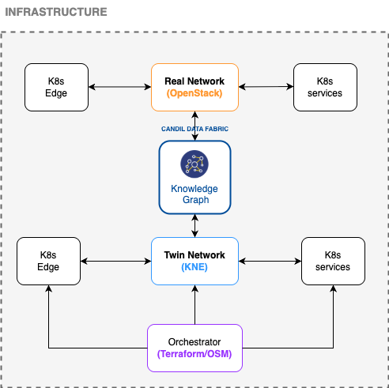
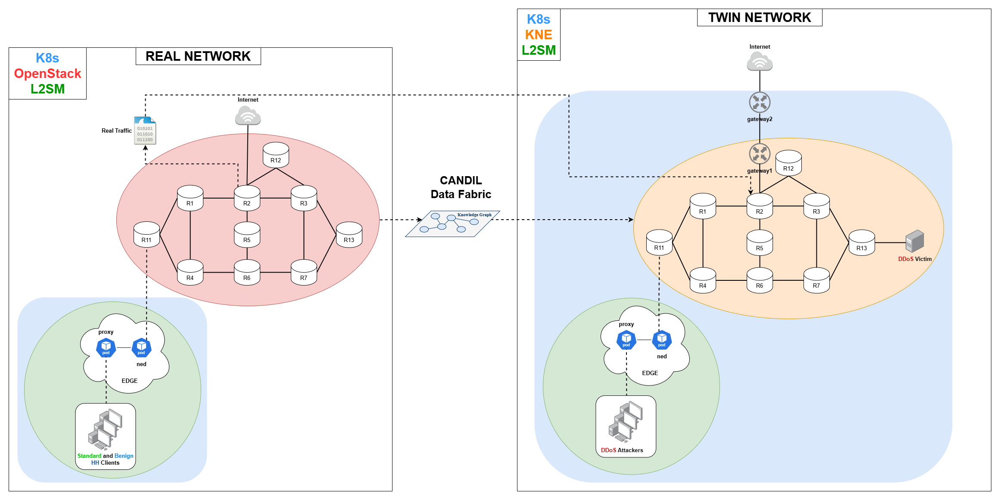

# Final prototype of an integrated Network Digital Twin (NDT) including the Edge



# Table of Contents

- [Prerequisites](#prerequisites):
  - [KNE](#kne)
  - [L2S-M](#l2s-m)
  - [OpenStack](#Openstack)
  - [Other requirements](#Other-requirements)
- [Overview of the Demo](#overview-of-the-demo)
- [Demo Video](#demo-video)
- [Deployment Guide](#deployment-guide)

# Prerequisites

## KNE
### Installation

- For installing **KNE**, follow the instructions provided in the official repository: [KNE GitHub Repository](https://github.com/openconfig/kne).

### Tested Environment

This demo was tested on a 1-node cluster with the following configuration:

- **Kubernetes**: v1.27.3
- **Network Plugin**: Flannel CNI
- **Load Balancer**: MetalLB
- **Docker**: Used as the CRI. Refer to the [Docker installation guide](https://docs.docker.com/engine/install/). v20.10.21.
- **Python**: v3.8.10.
- **Go**: v1.20.1.
- **Router Images**: Download the image from [FRRouting](https://docs.frrouting.org/projects/dev-guide/en/latest/building-docker.html). _Tested with the release 10.3_

## L2S-M:
### Installation

- For installing **L2S-M**, follow the instructions provided in the official repository: [L2S-M GitHub Repository](https://github.com/Networks-it-uc3m/L2S-M/tree/main/deployments)

### Tested Environment

This demo was tested on a microK8s cluster with the following configuration:
- **Kubernetes**: MicroK8s v1.31.0 or later. _Tested on a single-node cluster._
- **Network Plugin**: Multus CNI.

## Openstack:

## Other requirements:
The deployment of the scenario has been automated using Ansible and Python. Therefore, both tools must be installed on the machine where you intend to deploy the topology. If they are not already installed, you can install them using the following command:
```
sudo apt install ansible python3
```

# Overview of the Demo


# Demo Video

# Deployment Guide


## Twin Network:

To fully set up the digital twin network, you can execute the following Python script 'mw-run.py', which will automatically launch the entire deployment process:
```
 python3 deployment-kne/mw-run.py
 ```
> **Note:**
>  1. It is necessary to load the images of the clients and routers previously in the machine where the topology will be deployed.
> 2. In the deployment-kne/mouseworld_topology/pod-gateway2.yaml file, to enable internet access, we are connecting the pod to its host's interface. You need to modify the interface name accordingly, depending on which interface you want to connect to.
> 3. ***The real time mirroring requires a dummy interface named `mirror` to be created on the worker node. If this interface is not present, the execution of `mw-mirror.yaml` may fail. You can create it manually by running:
>    ```bash
>    sudo ip link add name mirror type dummy
>    sudo ip link set mirror up
>    ```
>  ***This step can be omitted if you do not intend to use the real-time mirroring functionality.

