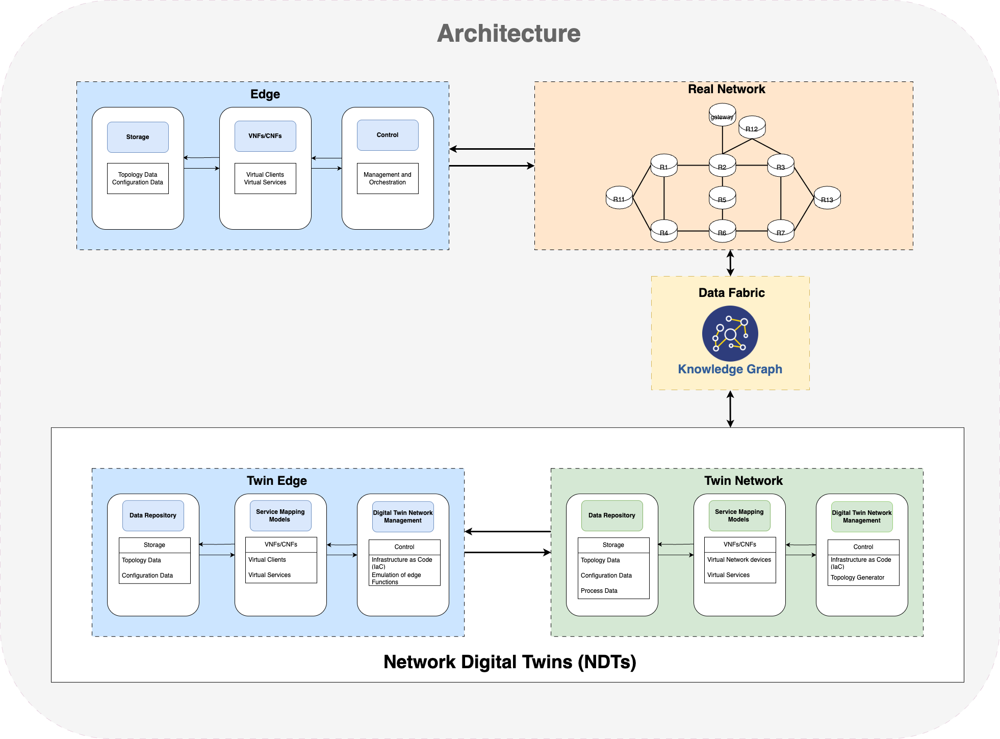
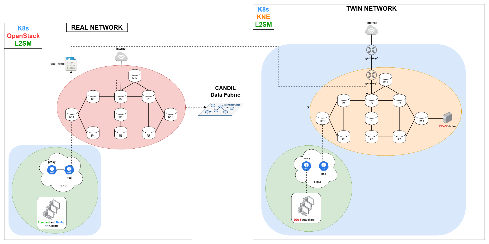

# Final prototype of an integrated Network Digital Twin (NDT) including the Edge
The architecture is composed of four modules: the Real Network, Edge Node, Data Fabric, and the Network Digital Twin (NDT). The following sections detail the prerequisites and deployment procedures for each module within the final prototype architecture.
The diagram below illustrates the overall architecture.



# Table of Contents

- [Prerequisites](#prerequisites):
  - [KNE](#kne)
  - [L2S-M](#l2s-m)
  - [OpenStack](#Openstack)
  - [Other requirements](#Other-requirements)
- [Overview of the Demo](#overview-of-the-demo)
- [Demo Video](#demo-video)
- [Deployment Guide](#deployment-guide)

# Prerequisites

## Openstack:

- To install **OpenStack**, follow the official instructions provided in the [Kolla Ansible Quickstart guide](https://docs.openstack.org/kolla-ansible/latest/user/quickstart.html#install-kolla-ansible). This was used for the **real network environment**.

--- 
## L2S-M:

This demonstrator uses **L2S-M** version v2.4.0, located in the L2S-M folder within this repository.
The official L2S-M repository is available here [here](https://github.com/Networks-it-uc3m/L2S-M.git)

### Edge Environment

For **edge and twin edge environments**, this demonstrator uses L2S-M together with a MicroK8s cluster:
- **Kubernetes**: MicroK8s v v1.32.3  or later. _Tested on a single-node cluster._
- **Network Plugin**: Multus CNI.

---

## KNE
### Installation

- For installing **KNE**, follow the instructions provided in the official repository: [KNE GitHub Repository](https://github.com/openconfig/kne).

### Twin Environment

This demonstrator uses **KNE** to deploy the **twin network**.  
It was tested on a cluster with one controller node and one worker node, with the following configuration:

- **Kubernetes**: v1.27.3
- **Network Plugin**: Flannel CNI
- **Load Balancer**: MetalLB
- **Docker**: Used as the CRI. Refer to the [Docker installation guide](https://docs.docker.com/engine/install/). v20.10.21.
- **Python**: v3.8.10.
- **Go**: v1.20.1.
- **Router Images**: Download the image from [FRRouting](https://docs.frrouting.org/projects/dev-guide/en/latest/building-docker.html). _Tested with the release 10.3_

---
## Other requirements:
The deployment of the scenario has been automated using Ansible and Python. Therefore, both tools must be installed on the machine where you intend to deploy the topology. If they are not already installed, you can install them using the following command:
```
sudo apt install ansible python3
```

# Overview of the Demo
The demonstrator comprises two separate environments: a Real Network and a Twin Network, interconnected through a framework known as the CANDIL Data Fabric. The diagram below illustrates the overall scenario and how its components interact.



---

# Demo Video
[Ver video en YouTube](https://www.youtube.com/watch?v=v-coT4HT4Tw)

--- 
# Deployment Guide
Each component is deployed independently following the guides below:
- **Real Network**: OpenStack-based deployment of a virtual network with FRRouting routers, supporting realistic traffic flows including standard and heavy hitter flows.

  - [Real Network Deployment](./realnetwork/README.md)

- **CANDIL Data Fabric**:
Semantic framework for real-time data integration and knowledge graph construction:
  - [mouseworld-kg](https://github.com/Mouseworld-Lab/mouseworld-kg)
  - [mouseworld-ontology](https://github.com/Mouseworld-Lab/mouseworld-ontology)

- **Edge**:
Kubernetes-based edge layer where client pods interface with both networks and generate realistic traffic.
  - [Edge Deployment](./Edge/rn-edge/README.md)
  - [Twin Edge Deployment](./Edge/tn-edge/README.md)

- **Twin Network**: Digital twin of the Real Network, deployed with KNE to emulate network scenarios.
  - [Twin Network Deployment](./deployment-kne/README.md)
